# 定位元素

## 盒模型

### 概念

页面版式主要由三个属性控制 : position 属性、 display 属性和 float 属性

#### 属性

边框(border)。可以设置边框的宽窄、样式和颜色。
内边距(padding)。可以设置盒子内容区与边框的间距。
外边距(margin)。可以设置盒子与相邻元素的间距。

#### 简写样式

属性值的顺序是上、右、下、左

每个盒子的属性也分三种粒度,到底选择哪个粒度的属性,要看你想选择哪条边,以及那条边的哪个属性

```css
{border:2px dashed red;} /* 全部 3 个属性,全部 4 条边*/
{border-style:dashed;} /*1 个属性,全部 4 条边*/
{border-left-style:dashed;} /*1 个属性,1 条边*/
```

#### 盒子边框

- 宽度( border-width )

	可以使用 thin 、 medium 和 thick 等文本值,也可以使用除百分比和负值之外的任何绝对值

- 样式( border-style )

	有 none 、 hidden 、 dotted 、 dashed 、 solid 、 double 、 groove 、ridge 、 inset 和 outset 等文本值

- 颜色( border-color )

	可以使用任意颜色值,包括 RGB、HSL、十六进制颜色值和颜色关键字

#### 盒子内边距

#### 盒子外边距

#### 叠加外边距

垂直方向上的外边距会叠加

## 盒子有多大

### 没有宽度的盒子

没有(就是没有设置 width 的)宽度的元素始终会扩展到填满其父元素的宽度为止。添加水平边框、内边距和外边距,会导致内容宽度减少,减少量等于水平边框、内边距和外边距的和。

### 有宽度的盒子

为设定了宽度的盒子添加边框、内边距和外边距,会导致盒子扩展得更宽。实际上,盒子的 width 属性设定的只是盒子内容区的宽度,而非盒子要占据的水平宽度。

### box-sizing

#### content-box 标准盒模型

padding和border不被包含在定义的width和height之内。对象的实际宽度等于设置的width值和border、padding之和，即 ( Element width = width + border + padding ) 此属性表现为标准模式下的盒模型。

```css
.test1 {
  box-sizing:content-box;
  width:200px;
  padding:10px;
  border:15px solid #eee;
}
```

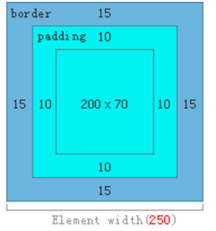

#### border-box 怪异盒模型

padding和border被包含在定义的width和height之内。对象的实际宽度就等于设置的width值，即使定义有border和padding也不会改变对象的实际宽度，即 ( Element width = width ) 此属性表现为怪异模式下的盒模型。

```css
.test1 {
  box-sizing:border-box;
  width:200px;
  padding:10px;
  border:15px solid #eee;
}
```


## 浮动与清除

### 浮动

CSS 设计 float 属性的主要目的,是为了实现文本绕排图片的效果。

浮动可以理解为让某个div元素 **脱离标准流，漂浮在标准流之上，和标准流不是一个层次**。

**假如某个div元素A是浮动的，如果A元素上一个元素也是浮动的，那么A元素会跟随在上一个元素的后边(如果一行放不下这两个元素，那么A元素会被挤到下一行)；如果A元素上一个元素是标准流中的元素，那么A的相对垂直位置不会改变，也就是说A的顶部总是和上一个元素的底部对齐。**

假如我们把div2、div3、div4都设置成左浮动，效果如下：


假如把div2、div3、div4都设置成右浮动，效果如下：


假如我们只把div2、div4左浮动，效果图如下：
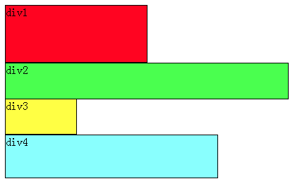

div4总是保证自己的顶部和上一个元素div3(标准流中的元素)的底部对齐。

**清除浮动可以理解为打破横向排列。**

对于CSS的清除浮动(clear)，一定要牢记：这个规则只能影响使用清除的元素本身，不能影响其他元素。

[链接1](http://www.cnblogs.com/zhongxinWang/archive/2013/03/27/2984764.html)

[链接2](http://www.iyunlu.com/view/css-xhtml/55.html)

#### 文本绕排图片

浮动非图片元素时,必须给它设定宽度,否则后果难以预料。图片无所谓,因为它本身有默认的宽度。

```html

<p>...the paragraph text...</p>
```

```css
/*为简明起见,省略了字体声明*/
p {margin:0; border:1px solid red;}
/*外边距防止图片紧挨文本*/
img {float:left; margin:0 4px 4px 0;}
```
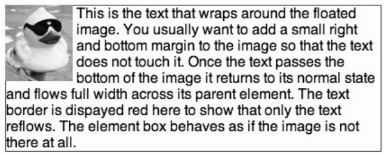

#### 创建分栏

```css
p {float:left; margin:0; width:200px; border:1px solid red;}
img {float:left; margin:0 4px 4px 0;}
```

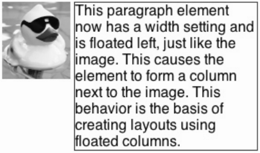

浮动元素位于“文档流外部”,因而它已经不被包含在标记中的父元素之内了。正因为如此,它对布局可能产生破坏性影响。

### 围住浮动元素

#### 问题

##### 浮动前

```css
section {border:1px solid blue; margin:0 0 10px 0;}
/*删除默认的上下外边距*/
p {margin 0;}
/*为简明起见,省略了字体声明*/
footer {border:1px solid red;}
```

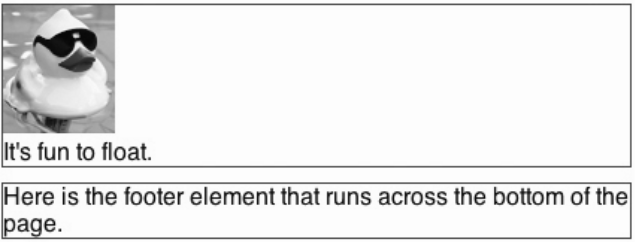

##### 浮动后

```css
section {border:1px solid blue; margin:0 0 10px 0;}
img {float:left;}
footer {border:1px solid red;}
```


浮动图片后标题跑到了右边,但父元素 section 也收缩到只包含文本的高度高度

### 方法一 : 为父元素添加 overflow:hidden

```css
section {border:1px solid blue; margin:0 0 10px 0; overflow:hidden;}
img {float:left;}
p {border:1px solid red;}
```


实际上, `overflow:hidden`声明的真正用途是防止包含元素被超大内容撑大。应用`overflow:hidden` 之后,包含元素依然保持其设定的宽度,而超大的子内容则会被容器剪切掉。除此之外, `overflow:hidden`还有另一个作用,即它能可靠地迫使父元素包含其浮动的子元素。

### 方法二 : 同时浮动父元素

```css
section {border:1px solid blue; float:left; width:100%;}
img {float:left;}
footer {border:1px solid red; clear:left;}
```


浮动 section 以后,不管其子元素是否浮动,它都会紧紧地包围(也称收缩包裹)住它的子元素。因此,需要用 width:100% 再让 section 与浏览器容器同宽。所以 footer 会努力往上挤到它旁边去。为了强制 footer 依然呆在 section 下方,要给它应用 clear:left 。被清除的元素不会被提升到浮动元素的旁边。

### 方法三:添加非浮动的清除元素

给父元素的最后添加一个非浮动的子元素,然后清除该子元素。由于包含元素一定会包围非浮动的子元素,而且清除会让这个子元素位于(清除一侧)浮动元素的下方,因此包含元素一定会包含这个子元素——以及前面的浮动元素。在包含元素最后添加子元素作为清除元素的方式有两种。

### 没有父元素时如何清除

采用方法三

```css
section {
	width: 300px;
}
img {
	float: left;
	margin: 0 4px 4px 0;
}
p {
	font-family: helvetica, arial, sans-serif;
	margin: 0 0 5px 0;
}
```


```html
<section>
	
	<p>This text sits next to the image and because the text extends below the bottom of the image, the next image
	positions itself correctly under the previous image.</p>
	
	<p>This text is short, so the next image can float up beside this one.</p>
	
	<p>Because the previous image's text does not extend below it, this image and text move up next to the previous
	image. This problem can be solved by the use of the clear property.</p>
</section>
```


**对比**
```css
section {
	width: 300px;
}

p {
	font-family: helvetica, arial, sans-serif;
	margin: 0 0 5px 0;
}

img {
	float: left;
	margin: 0 4px 4px 0;
	width: 80px;
}

.clearfix:after {
	content: ".";
	display: block;
	height: 0;
	clear: both;
	visibility: hidden;
}
```

```html
<section>

<p class="clearfix">This text sits next to the image and because the text extends below the bottom of the image, the
next image positions itself correctly under the previous image.</p>

<p class="clearfix">This text is short, so the next image can float up beside this one.</p>

<p class="clearfix">This is the text for the third image. When the clear property is applied, the image can no
longer float up and sits in the desired position.</p>
</section>
```

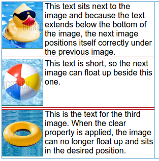

## 定位

### 概念

CSS 布局的核心是 position 属性，对元素盒子应用这个属性，可以相对于它在常规文档流中的位置重新定位。

position 属性有 4 个值: static 、 relative 、 absolute 、fixed ,默认值为 static

### 静态定位 static

对象遵循常规流。此时4个定位偏移属性不会被应用,不能通过z-index进行层次分级。

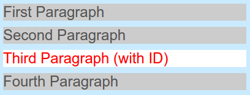

### 相对定位 relative

对象遵循常规流，并且参照自身在常规流中的位置通过top，right，bottom，left这4个定位偏移属性进行偏移时不会影响常规流中的任何元素。可以通过z-index进行层次分级。

```css
p #specialpara {
	position: relative;
	top: 25px;
	left: 30px;
	color: red;
	background: #fff;
}
```

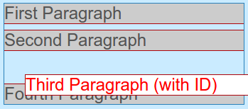

可以给 top 和 left 属性设定负值,把元素向上、向左移动。

### 绝对定位 absolute

对象脱离常规流，此时偏移属性参照的是离自身最近的定位祖先元素，如果没有定位的祖先元素，则一直回溯到body元素。盒子的偏移位置不影响常规流中的任何元素，其margin不与其他任何margin折叠，可以通过z-index进行层次分级。

```css
p #specialpara {
	position: absolute;
	top: 25px;
	left: 30px;
	color: red;
	background: #fff;
}
```


绝对定位的元素完全脱离了常规文档流,它默认的定位上下文是 body 元素

### 固定定位 fixed

与absolute一致，但偏移定位是以窗口为参考。当出现滚动条时，对象不会随着滚动，可以通过z-index进行层次分级。

```css
p #specialpara {
	position: fixed;
	top: 25px;
	left: 30px;
	color: red;
	background: #fff;
}
```


## 显示属性

尽管 display 属性的值有很多,但大多数元素 display 属性的默认值不是 block ,就是 inline 。

把元素的 display 设定为 none ,该元素及所有包含在其中的元素,都不会在页面中显示。它们原先占据的所有空间也都会被“回收”,就好像相关的标记根本不存在一样。与此相对的是 visibility属性,这个属性最常用的两个相对的值是 visible (默认值)和 hidden 。把元素的visibility 设定为 hidden ,元素会隐藏,但它占据的页面空间仍然“虚位以待”。

## 背景

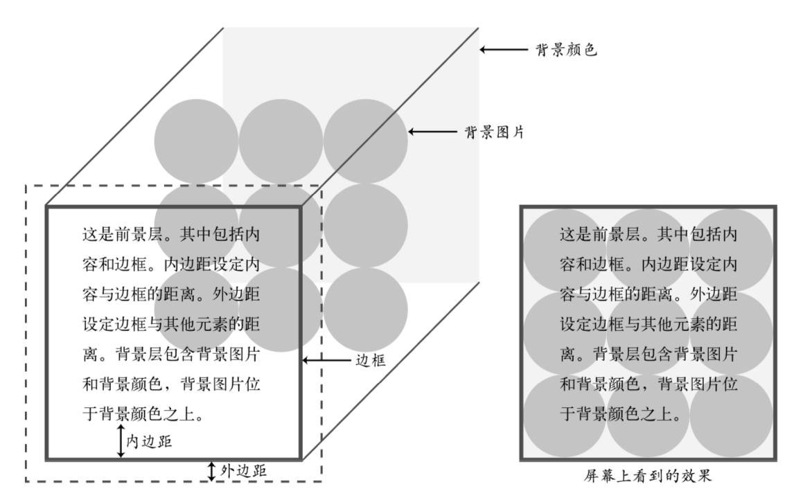

### 背景图片

background-image

### 背景重复

background-repeat

	repeat
	repeat-x
	repeat-y
	no-repeat

### 背景位置

background-position

默认情况下, background-position 的原点位于左上角。

top 、 left 、 bottom 、 right 和 center

top right 表示把图片放在元素的右上角位置, center center 把图片放在元素的中心位置

```css
p {
		height: 150px;
		width: 348px;
		border: 2px solid #AAA;
		margin: 20px auto;
		font: 24px/150px helvetica, arial, sans-serif;
		text-align: center;
		background: url(images/turq_spiral_150.png) no-repeat 50% 50%;
}
```

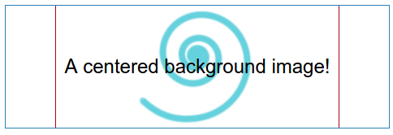

> 为什么文本也跟着垂直居中了呢?
	1. 因为line-height 设定成了元素的高度,而行高是在文本行上下平均分配的
	2. text-align 设定为 center ,把文本水平居中

有意思的是,还可以使用负值。这样就可以把图片的左上角定位到元素外部,从而在元素中只能看到部分图片。当然,给图片设定足够大的正值,也可以把图片的右下角推到元素外部,从而在元素中也只能看到部分图片。位于元素外部的那部分图片不会显示。

### 背景尺寸
background-size

50% :缩放图片,使其填充背景区的一半
100px 50px :把图片调整到 100 像素宽,50 像素高
cover :拉大图片,使其完全填满背景区;保持宽高比
contain :缩放图片,使其恰好适合背景区;保持宽高比

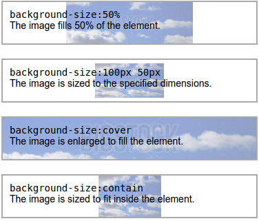

### 背景粘附

background-attachment

	scroll
		默认值,即背景图片随元素移动
	fixed
		背景图片不会随元素滚动而移动

### 多背景图片

CSS3 还可以给元素背景添加多个背景图片
多张图片可以在背景中叠加起来,CSS 规则中先列出的图片在上层

```css
p {
	height: 150px;
	width: 348px;
	border: 2px solid #AAA;
	margin: 20px auto;
	font: 24px/150px helvetica, arial, sans-serif;
	text-align: center;
	background: url(images/turq_spiral.png) 30px -10px no-repeat,
	url(images/pink_spiral.png) 145px 0 no-repeat,
	url(images/gray_spiral.png) 140px -30px no-repeat, #ffbd75;
}
```

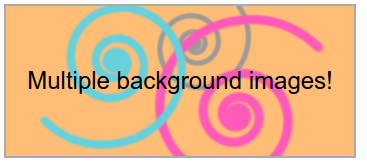

### 背景渐变

#### linear-gradient

默认为从上到下

```css
background:linear-gradient(#e86a43, #fff);
```

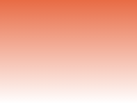

从左到右

```css
background:linear-gradient(left, #64d1dd, #fff);
```


左上到右下

```css
background:linear-gradient(-45deg, #e86a43, #fff);
```

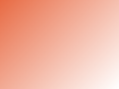

#### 渐变点

50%处有一个渐变点

```css
background:linear-gradient(#64d1dd, #fff 50%, #64d1dd);
```

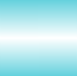

20%和 80%处有两个渐变点

```css
background:linear-gradient(#e86a43 20%, #fff 50%, #e86a43 80%)
```


25%、50%、75%处有三个渐变点

```css
background:linear-gradient(#64d1dd, #fff 25%, #64d1dd 50%, #fff 75%,#64d1dd);
```

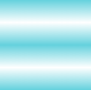

#### 放射性渐变

```css
.test {
	background: radial-gradient(circle at center, #f00, #ff0, #080);
}
```

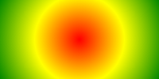

```css
.test2 {
	background: radial-gradient(circle closest-side, #f00, #ff0, #080);
}
```

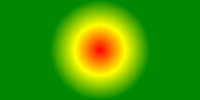
