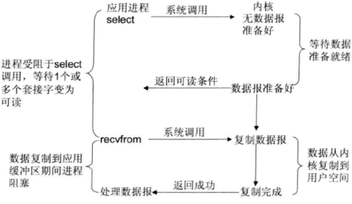
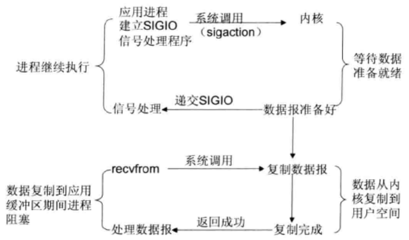
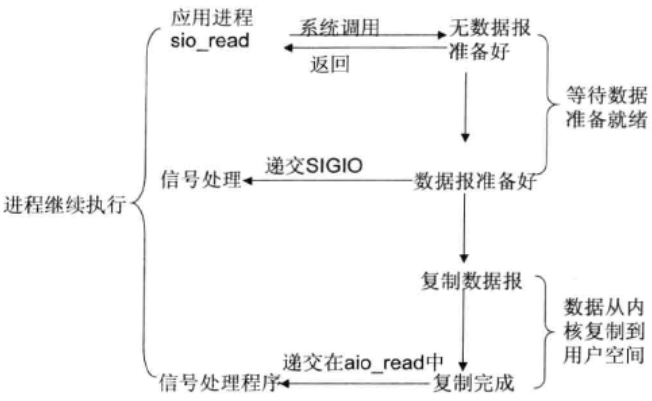
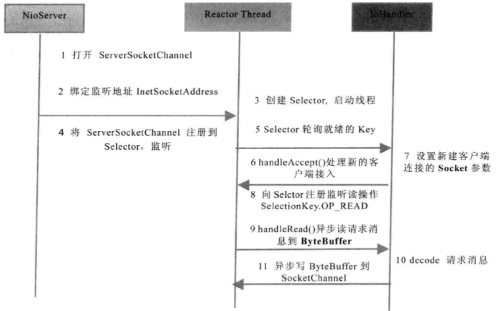

# NIO基础知识

## Linux网络I/O模型简介
根据UNIX网络编程对I/O模型的分类，UNIX提供了5种I/O模型

1. 阻塞I/O模型


2. 非阻塞I/O模型


3. I/O复用模型
select/poll 进程通过将一个或多个fd传递给select或poll系统调用


  I/O多路复用技术

  - 支持一个进程打开的socket描述符(FD)不受限制(仅受限于操作系统的最大文件句柄数)

  - I/O效率不会随着FD数目的增加而线性下降

  - 使用mmap加速内核与用户空间的消息传递

  无论是select、poll还是epoll都需要内核把FD消息通知给用户空间,如何避免不必要的内存复制就显得非常重要,epoll是通过内核和用户空间mmap同一块内存来实现的。

  - epoll的API更加简单

4. 信号驱动I/O模型


5. 异步I/O


## Java的I/O发展史

1. JDK1.4 NIO

  NIO以JSR-51的身份正式随JDK发布，主要的类和接口如下：
  - 进行异步I/O操作的缓冲区ByteBuffer等
  - 进行各种I/O操作(异步或者同步)的Channel
  - 多种字符集的编码能力和解码能力
  - 实现非肌塞I/O操作的多路复用器selector
  - 文件通道FileChannel

  不完善的地方：
  - 没有统一的文件属性(例如读写权限)
  - API能力比较弱,例如目录的级联创建和递归遍历,往往需要自己实现
  - 底层存储系统的一些高级API无法使用
  - 所有的文件操作都是同步阻塞调用,不支持异步文件读写操作

2. JDK1.7 NIO2.0

  - 增强文件处理
  - 提供AIO，支持基于文件的异步I/O操作和针对网络套接字的异步操作
  - 完成JSR-51定义的通道功能

## java IO编程

### 传统的同步阻塞式I/O编程（BIO）

```java
// 初始化
server = new ServerSocket(port);
// 获取socket及处理
socket = server.accept();
new Thread(new TimeServerHandler(socket)).start();
```

### 伪异步I/O编程


```java
// 初始化
server = new ServerSocket(port);
TimeServerHandlerExecutePool singleExecutor = new TimeServerHandlerExecutePool(50, 10000); // 创建IO任务线程池
// 获取socket及处理
socket = server.accept();
singleExecutor.execute(new TimeServerHandler(socket));
```

### 基于NIO的非阻塞编程

核心：Buffer，Channel，Selector

服务端序列图



```java
// 打开ServerSocketChannel,用于监听客户端的连接,它是所有客户端连接的父管道
ServerSocketChannel servChannel = ServerSocketChannel.open();
// 绑定监听端口,设置连接为非阻塞模式
servChannel.socket().bind(new InetSocketAddress(port), 1024);
servChannel.configureBlocking(false);
// 创建Reactor线程,创建多路复用器并启动线程
Selector selector = Selector.open();
New Thread(new ReactorTask()) .start ();
//将ServerSocketChannel注册到Reactor线程的多路复用器Selector上,监听ACCEPT事件
servChannel.register(selector, SelectionKey.OP_ACCEPT);
//多路复用器在线程run方法的无限循环体内轮询准备就绪的Key
int num = selector.select();
Set<SelectionKey> selectedKeys = selector.selectedKeys();
Iterator<SelectionKey> it = selectedKeys.iterator();
while (it.hasNext()) {
  SelectionKey key = it.next();
  // ... deal with I/O event ...
}
//多路复用器监听到有新的客户端接入,处理新的接入请求,完成TCP三次握手,建立物理链路
ServerSocketChannel ssc = (ServerSocketChannel) key.channel();
SocketChannel sc = ssc.accept();
//设置客户端链路为非阻塞模式
sc.configureBlocking(false);
sc.socket().setReuseAddress(true);
//将新接入的客户端连接注册到Reactor线程的多路复用器上,监听读操作,读取客户端发送的网络消息
sc.register(selector, SelectionKey.OP_READ);
//异步读取客户端请求消息到缓冲区
int readBytes = sc.read(readBuffer);
//对ByteBuffer进行编解码,如果有半包消息指针reset,继续读取后续的报文,将解码成功的泊息封装成Task,投递到业务线程池中,进行业务逻辑编排
Object message = null;
while(buffer.hasRemain()) {
  byteBuffer.mark();
  Object message = decode(byteBuffer);
  if (message == null) {
    byteBuffer.reset();
    break;
  }
  messageList.add(message);
}
if (IbyteBuffer.hasRemain())  
  byteBuffer.clear();
else
  byteBuffer.compact ();
if (messageList != null & !messageList.isEmpty()) {
  for (Object messageE : messageList)
    handlerTask(messageE);
}
//将POJO对象encode成ByteBuffer,调用SocketChannel的异步write接口,将消息异步发送给客户端
socketChannel.write(buffer);
```

### 基于NI02.0的异步非阻塞(AIO)编程

AsynchronousServerSocketChannel和AsynchronousSocketChannel,它们都由JDK底层的线程池负责回调并驱动读写操作。
正因为如此,基于NIO2.0新的异步非阻塞Channel进行编程比NIO编程更为简单。

*各种回调函数，杂技的不行 -_-*

## 不选择Java原生NIO编程的原因

- 使用麻烦

- 因为NIO编程涉及到Reactor模式,你必须对多线程和网路编程非常熟悉

- 可靠性能力补齐，工作最和难度都非常大。例如客户端面临断连重连、网络闪断、半包读写、失败缓存、网络拥塞和异常码流的处理等问题

- JDK NIO的BUG，例如炅名昭著的epoll bug
