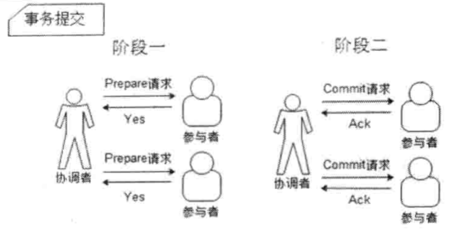

# 一致性协议

为了解决分布式一致性问题,在长期的探索研究过程中,涌现出了一大批经典的一致性协议和算法,其中最著名的就是二阶段提交协议、三阶段提交协议和Paxos算法了。

## 2PC (Two-Phase Commit)

二阶段提交协议是将事务的提交过程分成了两个阶段来进行处理

优点:原理简单,实现方便。

缺点:同步阻塞、单点问题、脑裂、太过保守。

- 同步阻塞

二阶段提交协议存在的最明显也是最大的一个问题就是同步阻塞,这会极大地限制分布式系统的性能。在二阶段提交的执行过程中,所有参与该事务操作的逻辑都处于阻塞状态,也就是说,各个参与者在等待其他参与者响应的过程中,将无法进行其他任何操作。

- 数据不一致

在二阶段提交协议的阶段二,即执行事务提交的时候,当协调者向所有的参与者发送Commit请求之后,发生了局部网络异常或者是协调者在尚未发送完Commit请求之前自身发生了崩溃,导致最终只有部分参与者收到了commit请求。于是,这部分收到了Commit请求的参与者就会进行事务的提交,而其他没有收到Commit请求的参与者则无法进行事务提交,于是整个分布式系统便出现了数据不一致性现象。

- 太过保守

二阶段提交协议没有设计较为完善的容错机制,任意一个节点的失败都会导致整个事务的失败。

## 3PC(Three-Phase Commit)

相较于二阶段提交协议,三阶段提交协议最大的优点就是降低了参与者的阻塞范围,并且能够在出现单点故障后继续达成一致。

三阶段提交协议在去除阻塞的同时也引入了新的问题,那就是在参与者接收到preCommit消息后,如果网络出现分区,此时协调者所在的节点和参与者无法进行正常的网络通信,在这种情况下,该参与者依然会进行事务的提交,这必然出现数据的不一致性。

## Paxos算法
