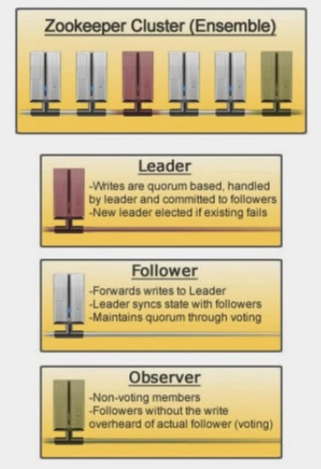

# ZooKeeper与Paxos

## ZooKeeper介绍

ZooKeeper并没有直接采用Paxos算法,而是采用了一种被称为ZAB(ZooKeeper Atomic Broadcast)的一致性协议。

ZooKeeper是一个典型的分布式数据一致性的解决方案,分布式应用程序可以基于它实现诸如数据发布/订阅、负载均衡、命名服务、分布式协调/通知、集群管理、Master选举、分布式锁和分布式队列等功能。ZooKeeper可以保证如下分布式一致性特性。

- 顺序一致性

从同一个客户端发起的事务请求,最终将会严格地按照其发起顺序被应用到ZooKeeper中去。

- 原子性

所有事务请求的处理结果在整个集群中所有机器上的应用情况是一致的。

- 单一视图

无论客户端连接的是哪个ZooKeeper服务器,其看到的服务端数据模型都是一致的。

- 可靠性

一旦服务端成功地应用了一个事务,并完成对客户端的响应,那么该事务所引起的服务端状态变更将会被一直保留下来,除非有另一个事务又对其进行了变更。

- 实时性

ZooKeeper仅仅保证在一定的时间段内,客户端最终一定能够从服务端上读取到最新的数据状态。

## ZooKeeper的设计目标

ZooKeeper致力于提供一个高性能、高可用,且具有严格的顺序访问控制能力(主要是写操作的严格顺序性)的分布式协调服务。高性能使得ZooKeeper能够应用于那些对系统吞吐有明确要求的大型分布式系统中,高可用使得分布式的单点问题得到了很好的解决,而严格的顺序访问控制使得客户端能够基于ZooKeeper实现一些复杂的同步原语。

- 简单的数据模型

ZooKeeper使得分布式程序能够通过一个共享的、树型结构的名字空间来进行相互协调。

- 可以构建集群

只要集群中存在超过一半的机器能够正常工作,那么整个集群就能够正常对外服务。

ZooKeeper的客户端程序会选择和集群中任意一台机器共同来创建一个TCP连接,而一旦客户端和某台ZooKeeper服务器之间的连接断开后,客户端会自动连接到集群中的其他机器。

- 顺序访问

对于来自客户端的每个更新请求,ZooKeeper都会分配一个全局唯一的递增编号,这个编号反映了所有事务操作的先后顺序,应用程序可以使用ZooICeeper的这个特性来实现更高层次的同步原语。

- 高性能

由于ZooKeeper将全量数据存储在内存中,并直接服务于客户端的所有非事务请求,因此它尤其适用于以读操作为主的应用场景。

## ZooKeeper的基本概念

### 集群角色

Leader服务器为客户端提供读和写服务。

### 会话 (Session)

### 数据节点 (Znode)

在ZooKeeper中,ZNode可以分为持久节点和临时节点两类。所谓持久节点是指一旦这个ZNode被创建了,除非主动进行ZNode的移除操作,否则这个ZNode将一直保存在ZooKeeper上。而临时节点就不一样了,它的生命周期和客户端会话绑定,一旦客户端会话失效,那么这个客户端创建的所有临时节点都会被移除。

### 版本

### Watcher

### ACL

ZooKeeper采用ACL(Access Control Lists)策略来进行权限控制,类似于UNIX文件系统的权限控制。

- CREATE : 创建子节点的权限。
- READ : 获取节点数据和子节点列表的权限。
- WRITE : 更新节点数据的权限。
- DELETE : 删除子节点的权限。
- ADMIN : 设置节点ACL的权限。

## ZAB协议

ZooKeeper并没有完全采用Paxos算法,而是使用了一种称为ZooKeeper Atomic Broadcast(ZAB,ZooKeeper原子消息广播协议) 的协议作为其数据一致性的核心算法。

ZAB协议是为分布式协调服务ZooKeeper专门设计的一种支持崩溃恢复的原子广播协议。ZAB协议并不像Paxos算法那样,是一种通用的分布式一致性算法,它是一种特別为ZooKeeper设计的崩溃可恢复的原子消息广播算法。

> 所有事务请求必须由一个全局唯一的服务器来协调处理,这样的服务器被称为Leader服务器,而余下的其他服务器则成为Follower服务器。Leader服务器负责将一个客户端事务请求转换成一个事务Proposal(提议),并将该Proposal分发给集群中所有的Follower服务器。之后Leader服务器需要等待所有Follower服务器的反馈,一旦超过半数的Follower服务器进行了正确的反馈后,那么Leader就会再次向所有的Follower服务器分发Commit消息,要求其将前一个Proposal进行提交。
