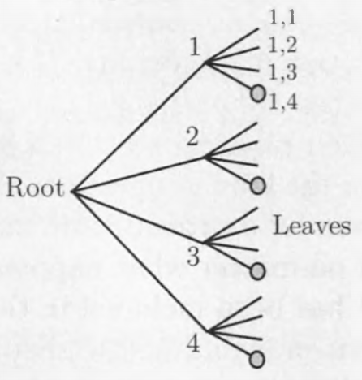

# Sample Space and Probability

## Sets

A set is **countably infinite** if it has one-to-one correspondence with the natural number set, $N$.

$\{x| x \text{ satisfies } P\}$ , the symbol "$|$" is to be read as "such that"(满足...条件)

**Uncountable set** There is no injective function from X to the set of natural numbers.

### Set Operations

$$S∪T=\{x|x∈S \text{ or } x∈T\}$$

$$S∩T=\{x|x∈S \text{ and } x∈T\}$$

$$\bigcup_{n=1}^\infty S_n=S_1∪S_2∪\cdots= \{x|x∈S_n \text{for some n}\}$$

$$\bigcap_{n=1}^\infty S_n=S_1∩S_2∩\cdots= \{x|x∈S_n \text{for all n}\}$$

Sets and the associated operations are easy to visualize in terms of **Venn Diagram(文森图)**

### The algebra of Sets

$$
\begin{array}{cc}
S∪T = T∪S                &    S∪(T∪U) = (S∪T)∪U        \\
S∩(T∪U) = (S∩T)∪(S∩U)   &    S∪(T∩U) = (S∪T)∩(S∪U)   \\
(S^c)^c = S               &    S∩S^c = ∅                 \\
S∪Ω = Ω                  &    S∩Ω = S
\end{array}
$$

**De Morgan’s laws**

$$\left(\bigcup_{n}S_n\right)^c=\bigcap_{n}S_n^c$$

$$\left(\bigcap_{n}S_n\right)^c=\bigcup_{n}S_n^c$$

## Probabilistic Models

### Elements of a Probabilistic Model

- The **sample space $Ω$**, which is the set of all possible **outcomes** of an experiment.
- The **probability law**, which assigns to a set $A$ of possible outcomes
(also called an $event$) a nonnegative number $P(A)$ (called the **probability** of $A$) that encodes our knowledge or belief about the collective “likelihood” of the elements of A . The probability law must **satisfy** certain properties to be introduced shortly. A subset of the sample space, that is, a collection of possible outcomes, is called an **event**.

### Choosing an Appropriate Sample Space

**mutually exclusive** 互斥

**collectively exhaustive** 全体穷尽

### Sequential Models

**tree-based sequential description**

### Probability Axioms

1. **(Nonnegativity)** $P (A) > 0$, for every event A

2. **(Normalization)** The probability of the entire sample space is
equal to 1, that is, $P(Ω) = 1$

3. **(Additivity)** If $A$ and $B$ are two disjoint events, then the probability of their union satisfies
$$P(A∪B) = P(A) + P(B)$$
More generally, if the sample space has an infinite number of elements and $A_1, A_2, \ldots$ is a sequence of disjoint events, then the probability of
their union satisfies
$$P(A_1 ∪ A_2 ∪ \cdots) = P(A_1) + P(A_2) + \cdots $$

### Discrete Models

**Discrete Probability Law**

If the sample space consists of a finite number of possible outcomes, then the probability law is specified by the probabilities of the events that consist of a single element. In particular, the probability of any event $\{s_1, \ldots , s_n\}$ is the sum of the probabilities of its elements:

$$P(\{s_1, \ldots , s_n\}) = P(s_1) + P(s_2) + \cdots + P(S_n)$$

**Discrete Uniform Probability Law**

If the sample space consists of n possible outcomes which are equally likely (i.e., all single-element events have the same probability), then the  probability of any event $A$ is given by

$$P(A) = \cfrac{  \text{number of elements of }A  }{n} $$

### Properties of Probability Laws

- If $A ⊂ B$, then $P (A) ≤ P(B)$
- $P(A ∪ B) = P(A) + P(B) - P(A ∩ B)$
- $P (A ∪ B) ≤ P (A) + P(B)$
- $P (A ∪ B ∪ C) = P(A) + P(A^c ∩ B) + P(A^c ∩ B^c ∩ C)$

### Models and Reality

## Conditional Probability

$P(A | B)$ : conditional probability of $A$ given $B$

$$P(A|B) = \cfrac{P(A∪B)}{P(B)}$$

### Conditional Probabilities Specify a Probability Law

把定义带入三条公理之中

### Using Conditional Probability for Modeling

**Multiplication Rule**

Assuming that all of the conditioning events have positive probability, we
have
$$P(∩_ {i=1}^nA_i)=i AA = P(A_1)P(A_2|A_1)P(A3|A_1∩A_2) \cdots P(A_n| ∩_ {i=1}^nA_i)$$

## Total Probability Theorem and Baye's Rule

**Total Probability Theorem**

Let $A_1 , \ldots , A_n$ be disjoint events that form a partition of the sample space (each possible outcome is included in exactly one of the events $A_1 , \ldots , A_n$) and assume that $P(A_i) > 0$, for all $i$. Then, for any event $B$, we have
$$
\begin{array}{lcl}
P(B) & = & P(A_1 ∩ B) + \cdots +  P (A_n ∩ B)        \\
     & = & P(A_1)P(B|A_1) + \cdots + P(A_n)P(B|A_n)   \\
\end{array}
$$

### Inference and Bayes’ Rule

**Bayes’ Rule**

Let $A_1 , \ldots , A_n$ be disjoint events that form a partition of the sample space, and assume that $P(A_i) > 0$, for all $i$. Then, for any event B such that $P(B) > 0$, we have
$$
\begin{array}{lcl}
P(A_i|B) & = & \cfrac{P(A_i)P(B|A_i)}{P(B)}  \\
         & = & \cfrac{P(A_i)P(B|A_i)}{P(A_1)P(B|A_1) + \cdots + P(A_n)P(B|A_n)}   \\
\end{array}
$$

Bayes’ rule is often used for **inference**. There are a number of “causes” that may result in a certain “effect.” We observe the effect, and we wish to infer the cause. The events $A_1 , \ldots , A_n$ are associated with the causes and the event B represents the effect. The probability $P(B|A_i)$ that the effect will be observed when the cause $A_i$ is present amounts to a probabilistic model of the cause-effect relation. Given that the effect $B$ has been observed, we wish to evaluate the probability $P (A_i | B)$ that the cause $A_i$ is present. We refer to $P (A_i | B)$ as the **posterior probability** of event $A_i$ given the information, to be distinguished from $P(A_i)$, which we call the **prior probability**.

**先验** 在拉丁文中指“来自先前的东西”，或稍稍引申指“在经验之前”。近代西方传统中，认为先验指无需经验或先于经验获得的知识。它通常与后验知识相比较，**后验** 意指“在经验之后”，需要经验。这一区分来自于中世纪逻辑所区分的两种论证，从原因到结果的论证称为“先验的”，而从结果到原因的论证称为“后验的”。
**先验概率** 是指根据以往经验和分析得到的概率，如全概率公式，它往往作为“由因求果”问题中的“因”出现。**后验概率** 是指在得到“结果”的信息后重新修正的概率，是“执果寻因”问题中的“因” 。后验概率是基于新的信息，修正原来的先验概率后所获得的更接近实际情况的概率估计。先验概率和后验概率是相对的。如果以后还有新的信息引入，更新了现在所谓的后验概率，得到了新的概率值，那么这个新的概率值被称为后验概率。

## INDEPENDENCE

$$\text{ A is independent of B } \qquad \Longleftrightarrow \qquad P(A∩B)=P(A)P(B)$$

if $A$ and $B$ are independent, the occurrence of $B$ does not provide any new information on the probability of $A$ occurring. It is then intuitive that the non-occurrence of $B$ should also provide no information on the probability of $A$. Indeed, it can be verified that if $A$ and $B$ are independent.

### Conditional Independence
