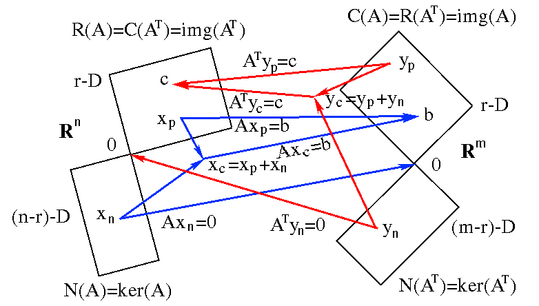

# Vector Spaces and Subspaces

## Spaces of Vectors

The space **$R^n$** consists of all column vectors $v$ with n components.

"Inside the vector space" means that **the result stays in the space**.

A **subspace** of a vector space is a set of vectors (including 0) that satisfies two requirments : If $v$ and $w$ are vectors in the subspace and $c$ is any scalar, then

- $v$ + $w$ is in the subspace

- $cv$ is in the subspace

*Every subspace contains the zero vector.*

The **column space** consists of **all linear combinations of the columns**.

The system $Ax=b$ is solvable if and only if $b$ is in the column space of $A$.

## The Nullspace of A: Solving Ax == 0

The **nullspace** of $A$ consists of all solutions to $Ax = 0$. $N(A)$ is a subspace of $R^n$.

The nullspace consists of all combinations of the **special solutions**.

The **reduced row echelon matrix** $R$ has zeros above the pivots as well as below:

$$
R=rref(A) = \begin{bmatrix} 1 & 1 & 0 & 1 \\ 0 & 0 & 1 & 1 \\ 0 & 0 & 0 & 0  \end{bmatrix}
$$

## The Rank and the Row Reduced Form

The rank of $A$ is the number of pivots.This number is $r$.

$Ax=0$ has $r$ pivots and $n-r$ free variables.$N(A)$ contains the $n-r$ special solutions.

## The Complete Solution to $Ax = b$

$$
\begin{array}{lll}
x_{particular} & \text{The particular solution solves}  & Ax_p=b \\
x_{nullspace}  & \text{The n-r special solution solves} & Ax_n=0
\end{array}
$$

$$x_{complete} = x_{particular} + x_{nullspace}$$

|    rank   |                        R                       |           A           | Ax = b solution |
|:---------:|:----------------------------------------------:|:---------------------:|:---------------:|
|  $r=m=n$  | $\begin{bmatrix} I \end{bmatrix}$              | Square and invertible | 1               |
|  $r=m<n$  | $\begin{bmatrix} I & F \end{bmatrix}$          |     Short and wide    | ∞               |
|  $r=n<m$  | $\begin{bmatrix} I \\ 0 \end{bmatrix}$         |     Tall and thin     | 0 or 1          |
| $r<n,r<m$ | $\begin{bmatrix} I & F \\ 0 & 0 \end{bmatrix}$ |     Not full rank     | 0 or ∞          |

## Independence, Basis and Dimension

The columns of $A$ are **independent** if $x = 0$ is the only solution to $Ax = 0$.

The vectors $v_1, \ldots , v_r$ **span** a space if their combinations fill that space.

The sequence of vectors $v_1,\ldots,v_n$ is **linearly independent** if the only combination that gives the zero vector is $0v_1+0v_2+0v_3+\cdots+0v_n$.

等价语句

- elimination produces n pivots
- the inverse exists
- non-singular matrix
- The column of $A$ are independent
- the rank of $A$ equals to $n$
- There are $n$ pivots and no free variables
- Only $x=0$ is in the nullspace
- $det(A) ≠ 0$

A **basis** for a vector space is a sequence of vectors with two properties: The basis vectors are linearly independent and they span the space.

The **dimension** of the space is the number of vectors in every basis.

### Bases for Matrix Spaces and Function Spaces

$$
\begin{array}{lll}
y'' = 0  & \text{is solved by any linear function} & y = ex + d \\
y'' = -y  & \text{is solved by any combination} & y = csin x + d cos x \\
y'' = y  & \text{is solved by any combination} & y = ce^x + de^{-x}
\end{array}
$$

## Dimensions of the Four Subspaces

$N(A^T)$称为 **Left Nullspace(左零空间)** 的原因:

$$A^Tx=0 \quad ⇒ \quad (A^Tx)^T=0^T \quad ⇒ \quad x^TA=0$$

即x为左乘A的解

求解$Ax=0$与四个空间的关系

求解$Ax=b$与四个空间的关系

### Rank One Matrix

Every rank one matrix has the speicial form $A=uv^T$ column times row.
