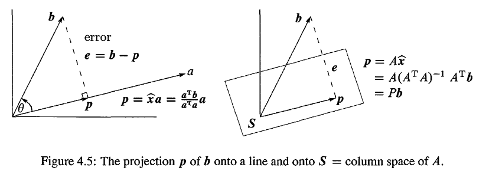
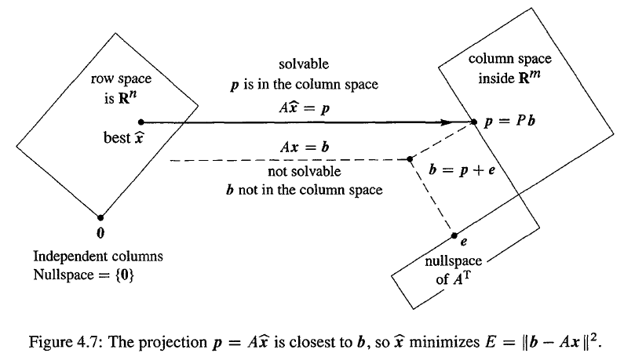

# Orthogonality

## Orthogonality of the Four Subspaces

Two vectors are **orthogonal** when their dot product is zero: $v \cdot w = 0$ or $v^Tw = 0$.

## Projections

When $Ax=b$ has no solution, multiply by $A^T$ and solve $A^TA \hat x = A^Tb$

### Projection Onto a Line

$$\hat x = \frac {a^Tb} {a^Ta}$$
$$p = a \frac {a^Tb} {a^Ta}$$
$$P = \frac {aa^T} {a^Ta}$$

### Projection Onto a Subspace

$$\hat x = (A^T A)^{-1}A^T b $$
$$p = A\hat x = A (A^T A)^{-1}A^T b $$
$$P = A (A^T A)^{-1}A^T$$

$A^TA$ is invertible if and only if $A$ has linearly independent column.

The projection matrix P has $P^T = P$ **对称(Symmetric)** and $P^2 = P$ **幂等性(Idempotence)**

### Least Squares Approximations

The previous section emphasized $p$ (**the projection**). This section emphasizes $\hat x$ (**the least squares solution**).

## Orthogonal Bases and Gram-Schmidt

The vectors $q_1,\ldots,q_n$ are **orthogonal** when $q_i \cdot q_j =0$.

The vectors $q_1,\ldots ,q_n$ are **orthonormal** if
$q_i^Tq_j = \begin{cases}
0 & when\ i \neq j & (\textbf{orthogonal} \text{ vectors}) \\
1 & when\ i = j & (\text{unit vectors} : \| q_i \| =1 )
\end{cases}$

A matrix with orthonormal columns is assigned the special letter $Q$

$$Q^TQ = I$$

When $Q$ is square, $Q^TQ = 1$ means that $Q^T= Q^{-1}$

*Every permutation matrix is an orthogonal matrix.*

### Projections Using Orthogonal Bases: Q Replaces A

When $Q$ is square and $m = n$, the subspace is the whole space. Then
$Q^T = Q^{-1}$ and $\hat x = Q^Tb$ is the same as $x = Q^{-1} b$. The solution is exact! The projection of $b$ onto the whole space is $b$ itself. In this case $P = Q Q^T = I$

### The Gram-Schmidt Process

$$
\left\{
\begin{array}{lll}
A & = & a \\
B & = & b-\cfrac{A^Tb}{A^TA}A \\
C & = & c-\cfrac{A^Tc}{A^TA}A-\cfrac{B^Tc}{B^TB}B
\end{array}
\right.
$$

### The Factorization $A = QR$

Any $m$ by $n$ matrix $A$ with independent columns can be factored into $QR$.

The least squares equation $A^TAx = A^Tb$ simplifies to $Rx = Q^Tb$

From independent vectors $a_1,\ldots,a_n$,Gram-Schmidt constructs orthonormal vectors $q_1,\ldots,q_n$. The matrices with these columns satisfy $A=QR$.Then $R=Q^TA$ is **upper triangular** because later $q$'s are orthogonal to earlier $a$'s.
