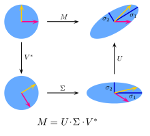
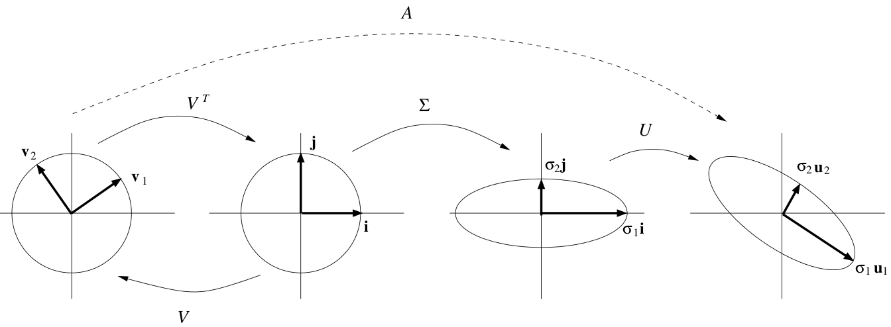

# Eigenvalues and Eigenvectors

## Introduction to Eigenvalues

The basic equation is $Ax = λx$. The number $λ$ is an **eigenvalue** of $A$.The vector $x$ is an **eigenvector** of $A$.

### The Equation for the Eigenvalues

$$Ax = λx \\
\Downarrow \\
(A-λI)x = 0 \\
\Downarrow \\
det(A-λI)=0
$$

To solve the eigenvalue problem for an n by n matrix, follow these steps:

1. Compute the determinant of $A-λI$
2. Find the roots of this polynomial
3. Solve $(A-λI)x=0$ to find an eigenvector $x$

> 矩阵A乘以x表示，对向量x进行一次转换（旋转或拉伸）（是一种线性转换），而该转换的效果为常数λ乘以向量x（即只进行拉伸）。
我们通常求特征值和特征向量即为求出该矩阵能使哪些向量（当然是特征向量）只发生拉伸，使其发生拉伸的程度如何（特征值大小）。这样做的意义在于，看清一个矩阵在那些方面能产生最大的效果（power），并根据所产生的每个特征向量（一般研究特征值最大的那几个）进行分类讨论与研究。

## Diagonalizing a Matrix

Suppose the $n$ by $n$ matrix $A$ has $n$ linearly independent eigenvectors $x_1,\ldots,x_n$.(**Without n independent eigenvectors, we can't diagonalize.**) Put them into the columns of an eigenvector matrix $S$. Eigenvalue matrix $Λ$
$$
Λ=\begin{bmatrix} λ_1 \\   & \ddots \\ & & λ_n \end{bmatrix}
$$
than
$$A=SΛS^{-1}$$

if **all the $λ$'s are different** then **n independent eigenvectors**

if **repeated eigenvectors** then **may or may not have n independent eigenvectors**

Remember that there is no connection between invertibility and diagonalizability:

**Invertibility** is concerned with the eigenvalues ($λ = 0$ or $λ \neq 0$).
**Diagonalizability** is concerned with the eigenvectors (too few or enough for $S$).

>If that diagonal matrix has any zeroes on the diagonal, then $A$ is not invertible. Otherwise, $A$ is invertible.

 $\begin{aligned} \textbf{Powers of }A \end{aligned} \qquad A^k =SΛ^kS^{-1}$

### Nondiagonalizable Matrices

**Eigenvectors (geometric)** There are nonzero solutions to $Ax = λx$
**Eigenvalues (algebraic)** The determinant of $A - λI$ is zero

The number A may be a simple eigenvalue or a multiple eigenvalue, we call this  **multiplicity**.

**geometric multiplicity , GM** Count the independent eigenvectors for A. This is the dimension of the nullspace of $A - λI$

**algebraic multiplicity , AM** Count the repetitions of $λ$ among the eigenvalues. Look at the $n$ roots of $det\ (A - λI) = 0$

*when GM is below AM means that A is not diagonalizable*

## Applications to Differential Equations

To convert **constant-coefficient differential equations** into linear algebra.

### Solution of $du/dt = Au$

$$Substitute \quad u= e^{kt}x \quad into \quad \cfrac{du}{dt} = Au\\
\Downarrow \\
ke^{kt}x=Ae^{kt}x \\
\Downarrow \\
kx=Ax \\
\Downarrow \\
k \text{ is eigenvalue } \quad x \text{ is eigenvector }
$$

$$
u= e^{kt}x \quad ⇒ \quad u(t) = c_1e^{λ_1t}x_1 + \cdots + c_ne^{λ_nt}x_n
$$

### Stability of 2 by 2 Matrices

Reference:

[微分方程](http://wenku.baidu.com/view/ef58aa75f242336c1eb95e72.html)

[What do eigenvalues and eigenvectors represent intuitively?](https://www.quora.com/What-do-eigenvalues-and-eigenvectors-represent-intuitively)

### The Exponential of a Matrix

$e^{At}$由无穷级数定义

$$e^{At} = I + At + \cfrac{1}{2}(At)^2 + \cfrac{1}{6}(At)^3 + \cdots + \cfrac{1}{n!}(At)^n + \cdots $$

## Symmetric Matrices

**谱定理（Spectral Theorem）** : Every symmetric matrix has the factorization $A=QΛQ^T=QΛQ^{-1}$ with real eigenvalues in $Λ$ and orthonormal eigenvectors in $S=Q$.

### All Symmetric Matrices are Diagonalizable

Every square matrix can be "triangularized" by $A = QTQ^{-1}$.

## Positive Definite Matrices

Symmetric matrices that have positive eigenvalues are called **positive definite**.

正定矩阵等价判定条件:

1. All $n$ eigenvalues are positive
2. All $n$ pivots are positive
3. All $n$ upper left determinants are positive
4. $x^TAx$ is positive except at $x=0$.(This is the energy-based definition.)
5. $A$ equals $R^TR$ for a matrix R with independent columns.

$A = R^TR$ is automatically positive definite if $R$ has independent columns.

## Similar Matrices

Diagonalization is not possible for every $A$. Some matrices have too few eigenvectors. In this new section, the eigenvector matrix $S$ remains the best choice when we can find it, but now we allow any invertible matrix $M$.

A typical matrix $A$ is similar to a whole family of other matrices because there are so many choices of $M$.

Let $M$ be any invertible matrix. Then $B = M^{-1}AM$ is **similar** to $A$.

## Singular Value Decomposition (SVD)

The eigenvectors in $S$ have three big problems: They are usually not orthogonal, there are not always enough eigenvectors, and $Ax = λx$ requires $A$ to be square. The singular vectors of $A$ solve all those problems in a perfect way.

$$A = UΣV^T$$

The $u$'s are eigenvectors of $AA^T$ and the $v$'s are eigenvectors of $A^TA$.

## Table of Eigenvalues and Eigenvectors

$$
\begin{array}{lll}
\text{Matrix} & \text{Eigenvalue Feature} & \text{Eigenvector Feature} \\
\hline
\mathbf{Symmetric:\ } A^T = A & \\
\mathbf{Orthogonal:\ } Q^T = Q^{-1} \\
\mathbf{Skew-symmetric:\ } A^T = -A \\
\mathbf{Complex\ Hermitian:\ } \overline{A}^T = A \\
\mathbf{Positive\ Definite:\ } x^TAx>0 \\
\mathbf{Markov:\ } m_{ij} > 0, \sum_{i=1}^n m_{ij} = 1 \\
\mathbf{Similar:\ } B= \\
\end{array}
$$
