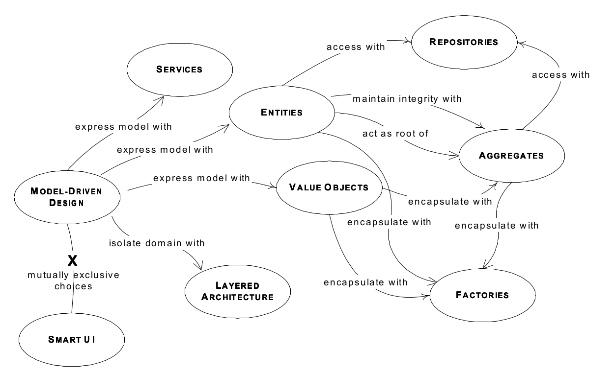

# 领域驱动设计

## 何为领域驱动设计

软件是由代码最终构成的。也许我们被代码所诱惑,在它上面花费了太多的时间,将软件看作是简单的对象或者方法。

为了创建一个好软件,你必须知道这个软件究竟是什么。在你充分了解金融业务是什么之前,你是做不出一个好的银行业软件系统领域的,你必须理解银行业的 **领域** 。

### 理解你的领域

在启动一个软件项目时,我们应该关注软件涉及的领域。软件的最终目的是增进一个特定的领域。为了达到这个目的,软件需要跟要它服务的领域和谐相处。

我们怎样才能让软件和领域和谐相处呢?最佳的方式是让软件成为领域的反射(映射)。软件需要具现领域里重要的核心概念和元素,并精确实现它们之间的关系。软件需要对领域进行建模。

按照Eric Evans的观点，**领域模型** 不是一幅具体的图,它是那幅图要极力去传达的那个思想。它也不是一个领域专家头脑中的知识，而是一个经过严格组织并进行选择性抽象的知识。一幅图能够描绘和传达一个模型，同样，经过精心编写的代码和一段英语句子都能达到这个目的。

模型是我们对目标领域的内部展现方式,它是非常必须的,会贯穿设计和开发的全过程。

我们需要这个模型跟领域专家进行交流,跟资深的设计人员进行交流,跟开发人员进行交流。模型是软件的根本,但我们需要找到一些方法来表现它, **让它和其他事物交流** 。

软件设计类似于构建房子的架构,那是跟一个总图相关的。代码设计是非常细节性的工作,类似于在一面墙上定位一幅油画。代码设计模型唾手可得,当需要时,它们会被很好地应用。优良的编码技巧可以帮助我们建立清晰、高可维护性的代码。

- 瀑布设计方法

  缺点和局限：业务专家得不到分析人员的反馈信息,分析人员也得不到开发人员的反馈信息。

- 敏捷方法

  敏捷方法试图解决的另一个问题被称为“分析瘫痪”,团队成员会因为害怕做出任何设计决定而无所事事。

  缺点和局限：缺乏了真实可见的设计原则,由开发人员执行地持续重构会导致代码更难理解或者更难改变。

### 构建领域知识

挖掘基础性的概念

领域专家掌握很多的专业技能,只是他们按照特殊的方式组织和使用这些知识,而这通常对要将它们实现到软件系统中不是件好事情。

## 通用语言

领域驱动设计的一个核心的原则是使用一种基于模型的语言。

使用模型作为语言的核心骨架。要求团队在进行所有的交流是都使用一致的语言,在代码中也是这样。在共享知识和推敲模型时,团队会使用演讲、文字和图形。这儿需要确保团队使用的语言在所有的交流形式中看上去都是一致的。因为这个原因,这种语言被称为“通用语言(Ubiquitous Language)”。

领域专家会反对用那些很笨拙的或者不适当的字眼或者结构来传达对领域的理解。如果领域专家不能理解模型或者语言中的某种内容,那么就如同是说这种内容存在某种错误。从另一方面讲,开发人员应该留意那些与他们试图呈现在设计中的内容存在二义性或者不一致的部分。

由软件架构师、开发人员和领域专家构成的开发团队,需要一种语言来统一它们的行动,以帮助它们创建一个模型,并使用代码来表现模型。

## 模型驱动设计

软件开发过程的重点，它必须 *以业务领域为中心* 。

我们说过让模型植根于领域、并精确反映出领域中的基础概念是建立模型的一个最重要的基础。建模过程的目的是创建一个优良的模型,下一步是将模型实现成代码。

紧密关联领域建模和设计。模型在构建时就考虑到软件和设计。开发人员会被加入到建模的过程中来。

### 模型驱动设计的基本构成要素

### 分层架构

将一个复杂的程序切分成层。开发每一个层中内聚的设计,让每个层仅依赖于它底下的那层。遵照标准的架构模式以提供层的低耦合。将领域模型相关的代码集中到一个层中,把它从用户界面、应用和基础设施代码中分隔开来。释放领域对象的显示自己、保存自己、管理应用任务等职责,让它专注于展现领域模型。这会让一个模型进一步富含知识,更清晰地捕获基础的业务知识,让它们正常工作。

一个通用领域驱动设计的架构性解决方案包含 4 个概念层:

| 概念层            | 说明                                                                                                                        |
|-------------------|-----------------------------------------------------------------------------------------------------------------------------|
| 用户界面 / 展现层 | 用户界面/ 负责向用户展现信息以及解释用户命令。                                                                              |
| 应用层            | 很薄的一层,用来协调应用的活动。它不包含业务逻辑。它不保留业务对象的状态,但它保有应用任务的进度状态。                        |
| 领域层            | 本层包含关于领域的信息。这是业务软件的核心所在。在这里保留业务对象的状态,对业务对象和它们状态的持久化被委托给了基础设施层。 |
| 基础设施层        | 本层作为其他层的支撑库存在。它提供了层间的通信,实现对业务对象的持久化,包含对用户界面层的支撑库等作用。                      |

### 实体

在软件中实现实体意味着创建标识符。

当一个对象可以用其标识符而不是它的属性来区分时,可以将它作为模型中的主要定义。

### 值对象

用来描述领域的特殊方面、且没有标识符的一个对象,叫做值对象。
